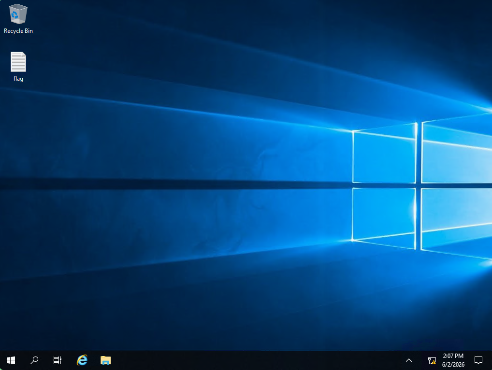

# 💥 Explosion
<div class="machine-properties">
  <span class="prop-badge windows">Windows</span> <span class="prop-badge very-easy">Very Easy</span> <span class="prop-badge skills">RDP</span> <span class="prop-badge skills">xfreerdp</span> <span class="prop-badge skills">Null Session</span>
</div>


Explosion is a **Very Easy** Windows box that demonstrates how a misconfigured RDP server with a null/empty Administrator password allows unauthenticated GUI access via `xfreerdp`.

---

## Recon

A full port scan reveals multiple open ports including **RDP (3389)**, SMB (445), and WinRM (5985) — indicating a modern Windows host with remote management exposed:

```
$ nmap -p- --open -sS --min-rate 5000 -vvv -n -Pn 10.129.10.7

PORT      STATE SERVICE       REASON
135/tcp   open  msrpc         syn-ack ttl 127
139/tcp   open  netbios-ssn   syn-ack ttl 127
445/tcp   open  microsoft-ds  syn-ack ttl 127
3389/tcp  open  ms-wbt-server syn-ack ttl 127
5985/tcp  open  wsman         syn-ack ttl 127
47001/tcp open  winrm         syn-ack ttl 127
49664/tcp open  unknown       syn-ack ttl 127
49665/tcp open  unknown       syn-ack ttl 127
49666/tcp open  unknown       syn-ack ttl 127
49667/tcp open  unknown       syn-ack ttl 127
49668/tcp open  unknown       syn-ack ttl 127
49669/tcp open  unknown       syn-ack ttl 127
49670/tcp open  unknown       syn-ack ttl 127
49671/tcp open  unknown       syn-ack ttl 127
```

A service scan confirms **Windows 10 build 17763**, RDP with a self-signed certificate, and SMBv3.1.1 with **signing enabled but not required**:

```
$ nmap -sCV -p135,139,445,3389,5985 10.129.10.7

PORT     STATE SERVICE       VERSION
135/tcp  open  msrpc         Microsoft Windows RPC
139/tcp  open  netbios-ssn   Microsoft Windows netbios-ssn
445/tcp  open  microsoft-ds?
3389/tcp open  ms-wbt-server Microsoft Terminal Services
| ssl-cert: Subject: commonName=Explosion
| Not valid before: 2026-06-01T20:38:02
|_Not valid after:  2026-12-01T20:38:02
| rdp-ntlm-info:
|   Target_Name: EXPLOSION
|   NetBIOS_Domain_Name: EXPLOSION
|   NetBIOS_Computer_Name: EXPLOSION
|   DNS_Domain_Name: Explosion
|   DNS_Computer_Name: Explosion
|   Product_Version: 10.0.17763
|_  System_Time: 2026-06-02T20:43:27+00:00
5985/tcp open  http          Microsoft HTTPAPI httpd 2.0 (SSDP/UPnP)
|_http-title: Not Found
|_http-server-header: Microsoft-HTTPAPI/2.0

Host script results:
| smb2-security-mode:
|   3.1.1:
|_    Message signing enabled but not required
```

Key findings:
- **RDP on 3389** — the primary attack vector; self-signed cert is normal for non-domain Windows hosts
- **SMB 3.1.1** — modern protocol, signing enabled but not enforced (potential relay vector if credentials were obtained)
- **WinRM on 5985** — remote shell access if credentials are found (not needed here)
- **Windows 10 build 17763** — Server 2019 / Windows 10 1809, modern enough to support Restricted Admin Mode

---

## Foothold

Attempt RDP login as `Administrator` with an **empty password**:

```
$ xfreerdp3 /v:10.129.10.7 /u:Administrator /cert-ignore

Password:                    <-- just press Enter
```

The connection succeeds — the Administrator account has **no password set**, granting full GUI access to the desktop. Open `flag.txt` from the Administrator's desktop to capture the flag.





> 💡 **Why this works:** Windows allows accounts with blank passwords by default in certain configurations (e.g., freshly provisioned VMs, misconfigured group policy). RDP with a blank password is explicitly permitted unless the Group Policy *"Limit local account use of blank passwords to console logon only"* is enforced.

---

## Key Takeaways

- **Always try `Administrator` with an empty password on RDP** — it's a surprisingly common misconfiguration on HTB boxes and CTF labs
- **`xfreerdp /cert-ignore`** is essential in CTF environments where Windows hosts use self-signed certificates
- The flag is on the Administrator's desktop — simply open the file once the RDP session is established
- No privilege escalation was needed — Administrator with a blank password is the root/user privilege all in one

