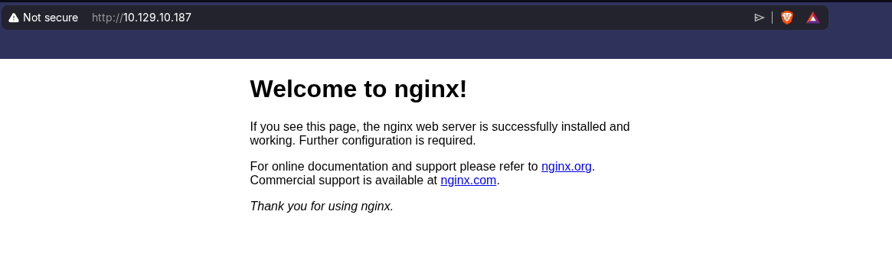
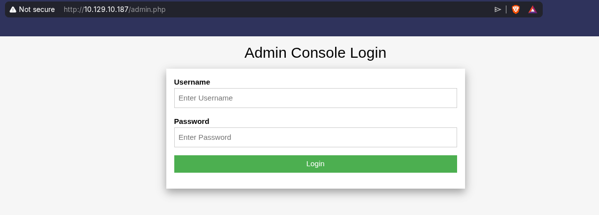
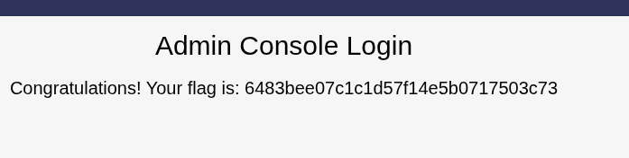

# 🧨 Preignition
<div class="machine-properties">
  <span class="prop-ip">10.129.10.187</span> <span class="prop-badge linux">Linux</span> <span class="prop-badge very-easy">Very Easy</span>
</div>


Preignition is a **Very Easy** Linux box that demonstrates how improper directory brute-forcing combined with default credentials on a hidden admin panel can grant access to a web application — no exploit required.

---

## Recon

A full port scan reveals a single open port — **HTTP** on 80:

```
$ nmap -p- --open -sS --min-rate 5000 -vvv -n -Pn 10.129.10.187

PORT   STATE SERVICE REASON
80/tcp open  http    syn-ack ttl 63
```

A service scan identifies **nginx 1.14.2** and a default welcome page:

```
$ nmap -sCV -p80 10.129.10.187

PORT   STATE SERVICE VERSION
80/tcp open  http    nginx 1.14.2
|_http-title: Welcome to nginx!
|_http-server-header: nginx/1.14.2
```

Key findings:
- **Single port** — minimal attack surface; the entire box hinges on what's behind this web server
- **nginx 1.14.2** — a stable, modern web server; no known RCE vulnerabilities at this version
- **Default nginx page** — no CMS, no custom index; the content is hidden behind undiscovered paths

---

## Foothold

Navigate to the web server to confirm the default nginx landing page:



With no visible links or clues in the source, directory brute-forcing is the next logical step. Run **gobuster** against common web extensions:

```
$ gobuster dir -u http://10.129.10.187 -w /usr/share/seclists/Discovery/Web-Content/DirBuster-2007_directory-list-2.3-medium.txt -x php,html -t 50

/admin.php           (Status: 200) [Size: 999]
```

A single hit — `admin.php` — an admin login panel hidden behind the default nginx splash:



Attempt **default credentials** — the most common misconfiguration on CTF admin panels:

```
user: admin
pass: admin
```

The login succeeds immediately:



> 💡 **Why this works:** Many web applications — especially in CTF environments — ship with default credentials (`admin:admin`, `admin:password`) that are never changed. Gobuster's job is to find the door; weak or default credentials are often all you need to walk through it.

---

## Key Takeaways

- **Default nginx pages hide everything** — always run directory brute-forcing even when the index page looks empty
- **Gobuster with extensions** (`-x php,html`) is essential — `admin.php` would not be found without the `.php` extension
- **Default credentials are everywhere** — `admin:admin` should be the first thing you try on any login form before reaching for hydra or wordlists
- **Single-port boxes are common in Starting Point** — don't overthink it; the vulnerability is often in the only service exposed
- No privilege escalation was needed — the admin panel granted everything after a single directory scan and a default password
